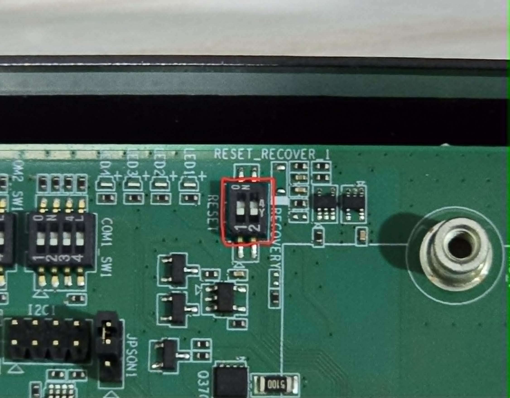

# ติดตั้ง OS ให้กับ Advantech AIR-030

> **Edge AI System — NVIDIA Jetson AGX Orin 32G / 64G**

คู่มือนี้อธิบายขั้นตอนการติดตั้ง OS บนเครื่อง [Advantech AIR-030](https://www.advantech.com/en-eu/products/932c8818-07cc-4917-89e9-7a678ddc029c/air-030/mod_a08e709e-09af-4124-bf1f-42d12c1c2fb0) โดยใช้ BSP Image ที่ได้รับจาก Advantech โดยตรง ผ่านเครื่อง Host PC ที่ติดตั้ง Ubuntu Linux

---

## Requirements

| รายการ | รายละเอียด |
|--------|-----------|
| Host PC OS | Ubuntu 22.04 LTS amd64 (Native — ไม่ใช่ VM หรือ WSL) |
| พื้นที่ว่าง | อย่างน้อย 50 GB |
| สาย | Micro USB ต่อจาก Host ไปยัง port OTG ด้านหลังของ AIR-030 |
| ไฟล์ | BSP Image (.tgz) ขนาด 8GB+ จาก Advantech |

---

## ขั้นตอนที่ 1 — เตรียม BSP File

โหลดไฟล์ BSP Image จาก Dropbox Link ด้านล่างนี้

🔗 **[Download BSP Image (Dropbox)](https://www.dropbox.com/scl/fo/ecsim47z4ry7kotmc4zec/AIgy5I4KqvY2ERTqkZOx0XY?rlkey=hse7xisvpkqlrhoq8hmizdr36&e=2&st=ijzvr5se&dl=0)**

ไฟล์ที่จำเป็นต้องโหลด:

- **ไฟล์ .tgz ขนาด 8GB+** — ไฟล์หลักสำหรับติดตั้ง OS
- **ไฟล์ .md5** — สำหรับตรวจสอบความสมบูรณ์ของไฟล์ (optional แต่แนะนำ)

> 💡 สามารถโหลด .log มาเพื่อดูค่า log อ้างอิงได้ แต่ค่าอาจแตกต่างจากการติดตั้งจริง

---

## ขั้นตอนที่ 2 — เตรียม Host PC

ติดตั้ง Ubuntu บนเครื่อง Host PC โดยสามารถหาวิธีได้จากอินเทอร์เน็ตทั่วไป

**ข้อกำหนดสำคัญ:**

- ใช้ **Ubuntu 22.04 LTS amd64** (แนะนำ — version อื่นอาจใช้ได้แต่ไม่ได้ทดสอบ)
- ต้องเป็น **Native Linux เท่านั้น** — ไม่รองรับ VM หรือ WSL เนื่องจาก USB passthrough ไม่เสถียร
- พื้นที่ว่างอย่างน้อย **50 GB** สำหรับแตกไฟล์ Image

> 💡 สามารถติดตั้ง Ubuntu บน Flash Drive หรือ External SSD เพื่อความสะดวกก็ได้

---

## ขั้นตอนที่ 3 — ติดตั้ง OS

### 3.1 ต่อสายและเข้า Recovery Mode

เสียบสาย **Micro USB** เข้าพอร์ตด้านหลังที่เขียนว่า **OTG** แล้วต่อเข้า Host PC

> ⚠️ **ห้ามให้สายหลุดระหว่างการติดตั้ง**

**วิธีเข้า Recovery Mode** (เลือกวิธีใดวิธีหนึ่ง):

**วิธีที่ 1** — กรณีเข้า OS ได้ปกติ:

```bash
sudo reboot --force forced-recovery
```

**วิธีที่ 2** — กรณีเข้า OS ไม่ได้: เปิดฝาหลังเครื่อง แล้วเลื่อน **Switch 2** ของ `RESET_RECOVERY_1` ขึ้นไปยังตำแหน่งที่ 4 (ON)



จากภาพจะเห็นว่าปุ่ม 1 อยู่ด้านล่างถูกต้องแล้ว แต่ปุ่ม 2 ควรต้องเลื่อนขึ้นไปที่ตำแหน่งเลข 4 เพื่อให้ Boot เข้า Recovery Mode ได้

---

### 3.2 ตรวจสอบการเชื่อมต่อ

ตรวจสอบว่า Host มองเห็น AIR-030 ผ่าน USB:

```bash
lsusb
```

ต้องเห็นรายการที่มีข้อความว่า **NVidia Corp.** ปรากฏขึ้นมา

---

### 3.3 ติดตั้ง Package ที่จำเป็น

```bash
sudo apt update

sudo apt install build-essential python3 libxml2-utils abootimg sshpass binutils -y
```

---

### 3.4 แตกไฟล์ Image

```bash
sudo tar -zxvf <ชื่อไฟล์.tgz>
```

> ⚠️ **สำคัญมาก — ต้องใช้ `sudo` ทุกครั้งที่รัน `tar`**
>
> หากไม่ใส่ `sudo` ไฟล์ใน rootfs จะสูญเสีย permission ที่จำเป็น (setuid, device node ฯลฯ) ผลคือ Flash สำเร็จแต่ **OS บูตไม่ขึ้น** — นี่คือข้อผิดพลาดที่พบบ่อยที่สุดในการติดตั้งครั้งนี้

เมื่อแตกไฟล์เสร็จแล้ว ลบไฟล์ .tgz เพื่อประหยัดพื้นที่:

```bash
sudo rm -f <ชื่อไฟล์.tgz>
```

---

### 3.5 ตรวจสอบพื้นที่ว่าง

```bash
df -h
```

> ⚠️ หากพื้นที่ว่างน้อยกว่า **40 GB** ให้ขยายพื้นที่ก่อน เพราะการ Flash ต้องการพื้นที่สำหรับแตกไฟล์ Kernel

---

### 3.6 Flash OS

```bash
cd Linux_for_Tegra

sudo ./flash.sh jetson-agx-orin-devkit mmcblk0p1
```

> 💡 กระบวนการ Flash ใช้เวลาประมาณ **10–20 นาที** ห้ามตัดไฟหรือถอดสาย USB ระหว่างนี้

> ⚠️ **ทุกคำสั่งในขั้นตอนนี้ต้องใช้ `sudo`** — ขาด `sudo` คำสั่งใดคำสั่งหนึ่งอาจทำให้ OS ไม่สมบูรณ์

---

## ขั้นตอนที่ 4 — ตรวจสอบหลังติดตั้ง

หลังติดตั้งเสร็จ ให้รันคำสั่งต่อไปนี้เพื่อตรวจสอบความสมบูรณ์ของระบบ

### ข้อมูล OS และ Kernel

```bash
cat /etc/os-release        # เช็ค OS version
cat /etc/nv_tegra_release  # เช็ค JetPack version
uname -a                   # เช็ค Kernel
```

### Hardware

```bash
tegrastats   # CPU/GPU usage
free -h      # Memory
df -h        # Storage
```

### GPU และ CUDA

```bash
nvidia-smi        # ข้อมูล GPU และ Driver
nvcc --version    # CUDA Compiler
```

> 💡 หาก `nvcc` ไม่พบถือเป็นเรื่องปกติ — CUDA Runtime ทำงานได้แต่ Toolkit ไม่ได้ติดตั้งมาใน Image นี้ สามารถติดตั้งเพิ่มได้ภายหลัง

### Network

```bash
ip a             # ดู Network Interface ทั้งหมด
ethtool eth00    # LAN Port 1
ethtool eth01    # LAN Port 2
ethtool eth02    # LAN Port 3
```

---

## ผลลัพธ์ที่ควรจะได้

| คำสั่ง | ผลลัพธ์ที่คาดหวัง |
|--------|------------------|
| `cat /etc/os-release` | Ubuntu 22.04.x LTS |
| `cat /etc/nv_tegra_release` | R36, JetPack 6.x |
| `nvidia-smi` | Driver 540.x / CUDA 12.x |
| `nvcc --version` | อาจไม่พบ — ปกติ |

---

*Advantech AIR-030 · NVIDIA Jetson AGX Orin · JetPack 6.x · Ubuntu 22.04 LTS*
